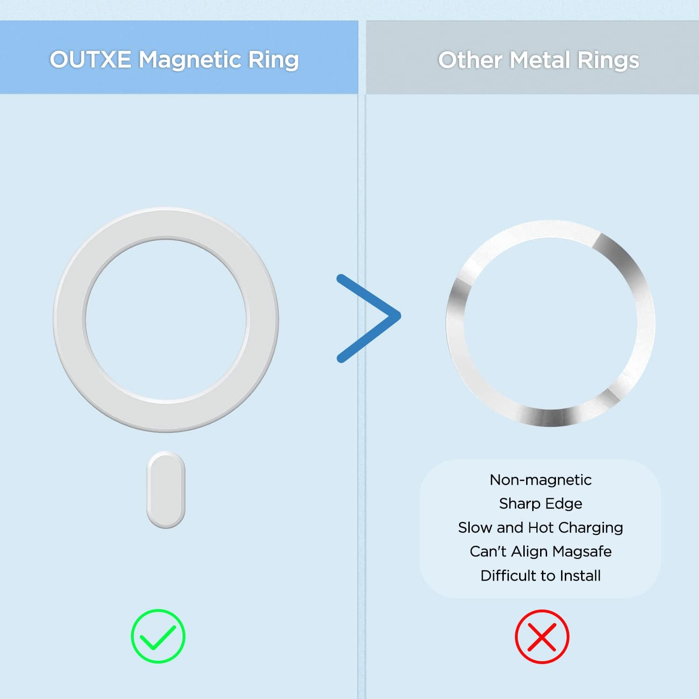
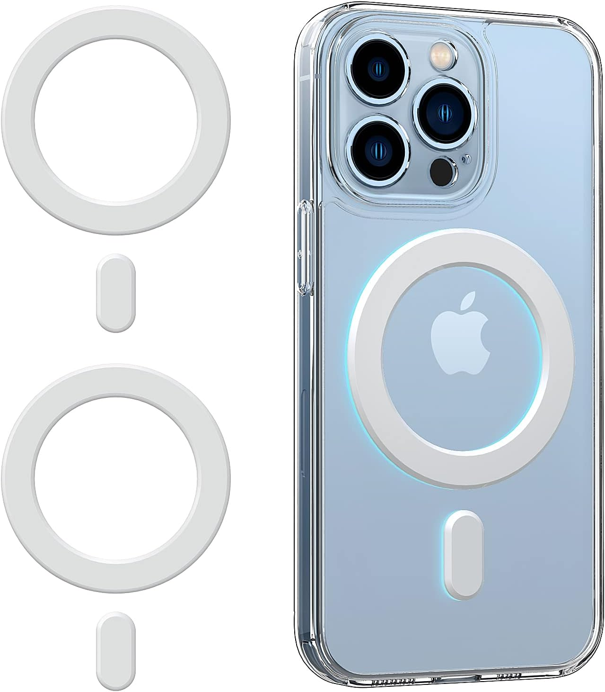
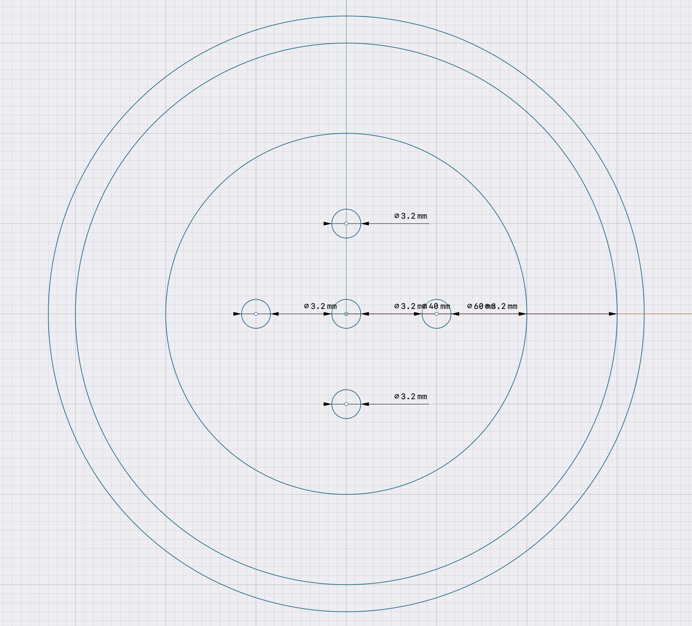

# MagBite

A reusable Mechanical Adapter based on Magsafe for Demos and Holding all sorts of things

To make it re-usable, MagBite uses a "cross" hole pattern for M3 screws with recesses so that the screws do not touch your device.

The hole pattern is excessive since a single screw can out-pace the mounting force of most Magsafe magnets, but it allows flexibility in how the ring is mounted. I recommend 2 screws per design on the "host" side.

The ring used is the OUTXE Magnetic Adapter Ring bought through Amazon. At the time of writing, a 2 pack cost $10. The main reason for going for it over normal adapters is that it's surrounded by a protective plastic that raises it and makes it less likely to scratch things. Otherwise Magbite can also just work fine with regular metal rings, although you may want to adjust the channel recess thickness to bring it closer to the surface. Currently the adapter is made so the ring sticks out 0.5mm.

### Mounting Trays

Example Mounting Trays for Magbite are provided as part of the repository.

Currently, the following adapters are provided:

- BeaglePlay + Dual QWIIC/GROVE Holder + RF - LINK
- Raspberry Pi 3/4/5B (Also Usable for Displays) - LINK
- Texas Instruments AM62x/AM62A/AM62P Starter Kit EVM - LINK
- VESA Mount - LINK SOON

If you make your own designs, please share them!
